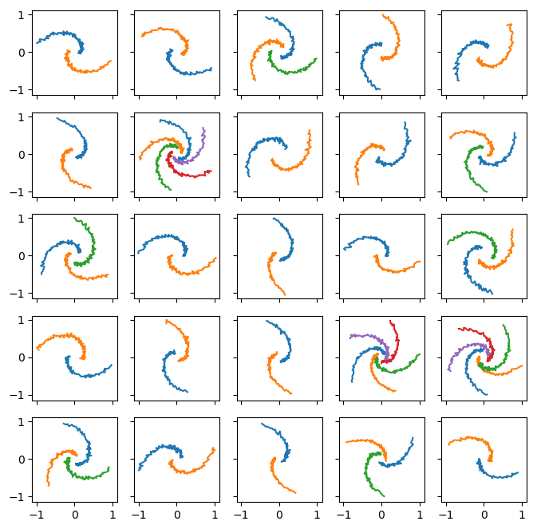
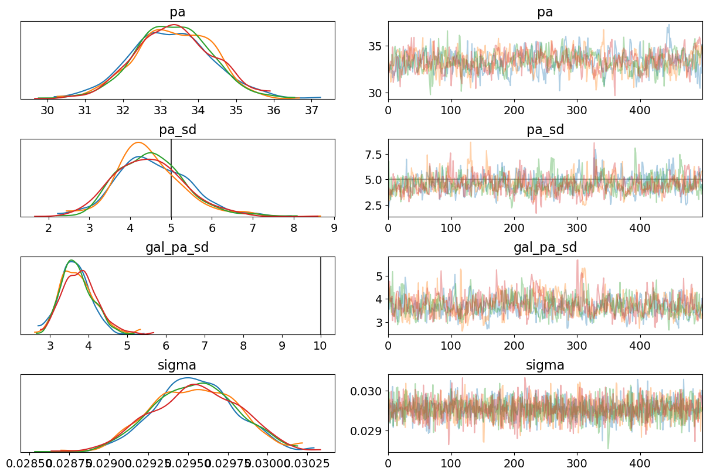

# Hierarchial Bayesian modelling of spiral galaxy pitch angle

This repository makes use of `pymc3` to model the pitch angle tightness of the *Galaxy Builder* main subject set, consisting of 297 (including 99 duplicate) spiral galaxies.

## Problem overview

We have a lot of galaxies with arms, but we want a reliable way of describing the resulting pitch angles. We tried fitting a log spiral to each arm and defining the galaxy's "global pitch angle" (global $\psi$) as the length-weighted average of the pitch angles of the arms.

The problem with this is that due to the potentially large inter-arm dispersions on pitch angle, the reported global $\psi$ is very dependent on the arms identified in the clustering step.

We instead considered fitting one global pitch angle to all identified arms (which will still have some of the problems associated with dependence on which arms were detecetd). We want to do this in a proper Bayesian manner.

## Proposed solution

Assume a galaxy's pitch angle is comprised of some measure of tightness and a chirality, and each of its arms have a rotation. We can describe the global distribution of these parameters

$$\phi_\mathrm{gal} \sim \mathrm{TruncatedNormal}(\mu_\mathrm{global}, \sigma_\mathrm{global}, \mathrm{min}=0, \mathrm{max}=90),$$

$$\phi_\mathrm{arm} \sim \mathrm{TruncatedNormal}(\phi_\mathrm{gal}, \sigma_\mathrm{gal}, \mathrm{min}=0, \mathrm{max}=90),$$

$$c \sim \mathrm{Cauchy}(\alpha=0,\,\beta=10).$$

And the equation for each log spiral arm is

$$ r_\mathrm{arm} = \exp\left[\theta\tan(\phi_\mathrm{arm}) + c_\mathrm{arm}\right] + \sigma_r.$$

Hyperpriors used are as follows:

$$\mu_\phi \sim \mathrm{Uniform}(0, 90)$$

$$\sigma_\mathrm{global} \sim \mathrm{InverseGamma}(\alpha=1,\,\beta=10)$$

$$\sigma_\mathrm{gal} \sim \mathrm{InverseGamma}(\alpha=1,\,\beta=10)$$

$$\sigma_r \sim \mathrm{HalfCauchy}(\beta=0.2)$$
We have, from *Galaxy Builder*, 199 galaxies with 367 spiral arms between them. We say

> "Each galaxy has its own realization of $\phi_\mathrm{gal}$, each arm has its own realization of $\phi_\mathrm{arm}$ and $c$, and there is a noise term on $r$"

We want to be able to describe the distributions of $\mu_\mathrm{global}$, $\sigma_\mathrm{global}$ and $\sigma_\mathrm{gal}$, for a given morphological type.

### Non-centered model

Change

$$y \sim \mathrm{Normal}(\mu_a, \sigma)$$

$$\mu_a \sim \mathrm{Normal}(\mu_a, \sigma)$$

to

$$t \sim \mathrm{Normal}(0, 1)$$

$$y \sim \mathrm{Normal}(0, 1)$$

$$y = mu + \sigma \sim \mathrm{Normal}(0, 1)$$

### In Practise

We use a NUTS sampler, initialized by running ADVI and then adapt the resulting diagonal mass matrix based on the sample variance of the tuning samples (performed entirely by `pymc3`, because it's very clever). We tune for **1000** steps and then sample **2000** steps for our results.

## Results
### Toy Model
We create a sample of clean logarithmic spirals, which we can use to iterate on the model, and test its predictions. This sample is randomly regenerated at runtime from an underlying distribution, for example:

Parameters used to create this sample were $\mu_\mathrm{global}=20$, $\sigma_\mathrm{global}=5$ and $\sigma_\mathrm{gal}=10$. The resulting traceplot is

### *Galaxy Builder* sample

This model has not yet been run successfully. Currently we are pre-selecting galaxies with two or more spiral arms. Examples of galaxies:

