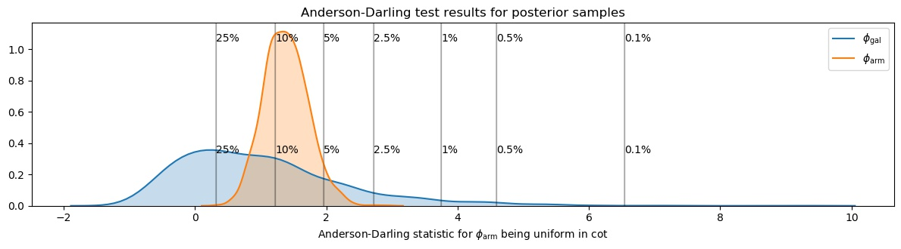

# Hierarchial Bayesian modelling of spiral galaxy pitch angle

This repository makes use of `pymc3` to model the pitch angle tightness of the *Galaxy Builder* main subject set, consisting of 297 (including 99 duplicate) spiral galaxies.

## Problem overview

We have a lot of galaxies with arms, but we want a reliable way of describing the resulting pitch angles. We tried fitting a log spiral to each arm and defining the galaxy's "global pitch angle" (global $\psi$) as the length-weighted average of the pitch angles of the arms.

The problem with this is that due to the potentially large inter-arm dispersions on pitch angle, the reported global $\psi$ is very dependent on the arms identified in the clustering step.

We instead considered fitting one global pitch angle to all identified arms (which will still have some of the problems associated with dependence on which arms were detecetd). We want to do this in a proper Bayesian manner.

## Proposed solution

Assume a galaxy's pitch angle is comprised of some measure of tightness and a chirality, and each of its arms have a rotation. We can describe the global distribution of these parameters

$$\phi_\mathrm{gal} \sim \mathrm{Uniform}(\mathrm{min}=0, \mathrm{max}=90),$$

$$\phi_\mathrm{arm} \sim \mathrm{TruncatedNormal}(\phi_\mathrm{gal}, \sigma_\mathrm{gal}, \mathrm{min}=0, \mathrm{max}=90),$$

$$c \sim \mathrm{Cauchy}(\alpha=0,\,\beta=10).$$

And the equation for each log spiral arm is

$$ r_\mathrm{arm} = \exp\left[\theta\tan(\phi_\mathrm{arm}) + c_\mathrm{arm}\right] + \sigma_r.$$

Hyperpriors used are as follows:

$$\sigma_\mathrm{gal} \sim \mathrm{InverseGamma}(\alpha=2,\,\beta=20)$$

$$\sigma_r \sim \mathrm{pm.InverseGamma}(\alpha=2,\, \beta=0.5)$$

This model is implemented in `UniformBHSM` in `super_simple/hierachical_model.py`.

We want to be able to describe the distributions of $\mu_\mathrm{global}$, $\sigma_\mathrm{global}$ and $\sigma_\mathrm{gal}$, for a given morphological type.

### In Practise

We use a NUTS sampler, initialized by running ADVI and then adapt the resulting diagonal mass matrix based on the sample variance of the tuning samples (performed entirely by `pymc3`, because it's very clever). We tune for **1000** steps and then sample **2000** steps for our results.

# The science

## Pitch angle vs morphology

### Bulge size
Is there a diffence between the pitch angles of galaxies which are *"bulge-dominated"*, and those that are *"disk-dominated"* (as predicted by the Hubble sequence)?

### Bar strength
Is there a diffence between the pitch angles of galaxies which are *"strongly-barred"*, and those that do not have a bar?

**Answer:** Using a *marginalized Anderson-Darling test*, we examine whether the populations of pitch angles (either $\phi_\mathrm{gal}$ or $\phi_\mathrm{arm}$) differe between galaxies that are bulge-dominated

## Investigating Spiral winding
Do spiral arms wind up over time, in the manner described by [Prinlge & Dobbs (2019)](https://ui.adsabs.harvard.edu/abs/2019MNRAS.490.1470P/abstract)?

The above plot suggests that individual spiral arms could well wind up over time in a similar manner to the above! The pitch angle of a galaxy is also generally consistent with the model too, but to a lesser extent.

