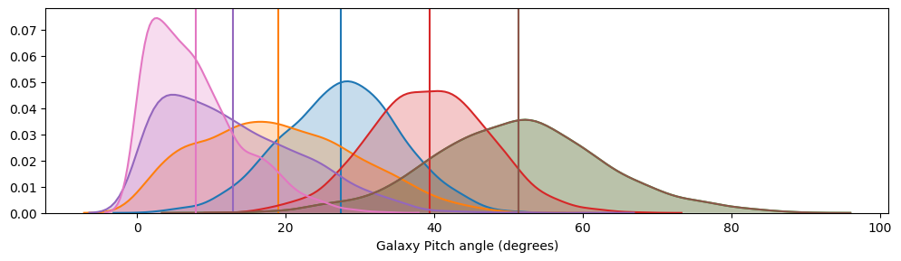
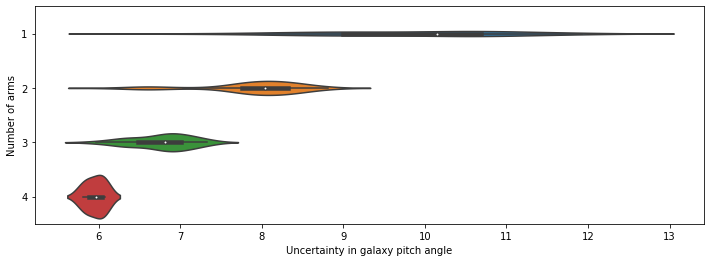

# Bayesian hierarchial modelling outline

## Contents

- Introducion
- Obtaining Spiral Arms through Galaxy Builder
 - A Hierarchical Bayesian approach to galaxy pitch angle measurement
- Results
	- Uniformity in $\cot\phi$ tested for length-weighted pitch angle from Galaxy Builder galaxies
	- Results from Hierarchical normal model
		- Comparisons to morphology
		- Comparisons to stellar mass
- Discussion

## Introducion

See LaTeX

## Obtaining Spiral Arms through Galaxy Builder

*TBC*

## Results 
### Uniformity in $\cot\phi$

We do not see uniformity in $\cot\phi$, with a Kolmogrov-Smirnov test on a selection of galaxy length-weighted pitch angles between $\cot(4)$ and $\cot(1)$ returning a probability of 0.011. A truncated normal distribution on the same sample recieved a probability of 0.9626.

### Results from Hierarchical model

**Global Results**
We find good constraints on the model's hyperparameters (the global mean and variance of galaxy pitch angles)

However, the pitch angle for an individual galaxy is not well constrained, as demonstrated by the large spread in posteriors:

**Comparisons to Morphology**

We see no correlation between galaxy pitch angle (obtained using the mean value of the posterior for each galaxy) and Galaxy Zoo 2's $p_\mathrm{bar}$ or $p_\mathrm{bulge}$, with Pearson correlation coefficients of -0.004 and 0.012 respectively.

**Comparison to Stellar mass**

*TBC*

## Discussion

It is commonly observed that spiral arms within a galaxy vary significantly in their pitch angle, hence the large variance in our galaxy pitch angle posteriors (as mentioned above). This is in a large part due to the limitation of only being able to measure a small number of arms for an individual galaxy - we see that variance in the galaxy pitch angle estimate drops as the number of arms increases:

This is potentially an indication that quoting a single "pitch angle" for a galaxy is highly subject to the number of spiral arms indentified by the method used, and highlights the difficulty in quantifying spiral tightness . 
